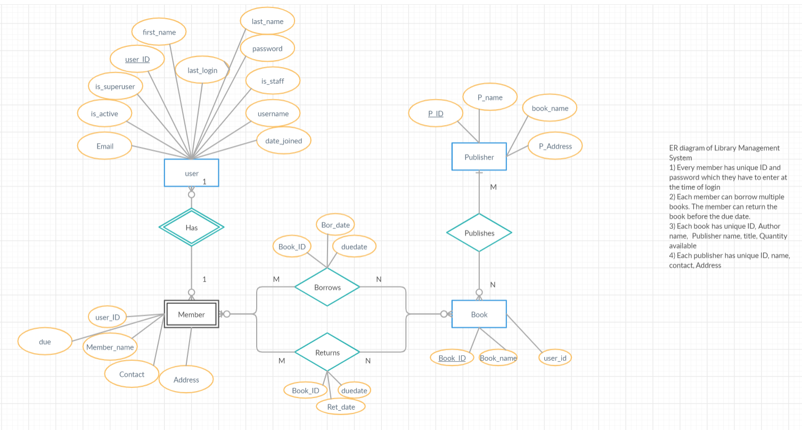
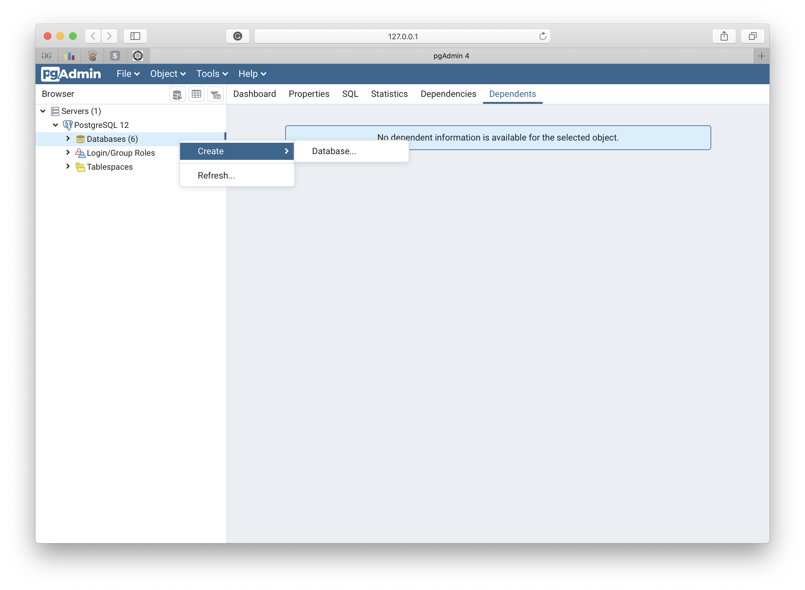

# Library Management System
This is the project on Library Management System build using django and postgresql database

## ER-Diagram
 ->This image is available in the image directory

# How to use this project
Install Python from here based on your platform : https://www.python.org/downloads/source/

Then Download this project by clone.

<br>Download the postgresql from here: https://www.postgresql.org/download/.<br>
Then download the PgAdmin here: https://www.pgadmin.org/download/.<br>

After this open postgresql and install according to the step provided and make sure<br>
that password you write is "dbms" without quote!.<br>
Then open PgAdmin it will open in the browser and write the password, then click on create new Database
 ->This image is available in the image directory

Name that database "Dbms2" without quote!.<br>
Make sure that password for the database and it name is same as written above,
then run this script below in terminal or cmd but make sure you are on the same directory that project is.

Use this:
```
 >>> pip install -r include.txt
```
or 
```
 >>> source ~/venv/bin/activate # for MacOS
```
then run below script :
```
 >>> python manage.py makemigrations
 >>> python manage.py sqlmigrate library 0001
 >>> python manage.py migrate
 >>> python manage.py createsuperuser # create the superuser/admin of the site by using the email id, username and password you enter.
 >>> python manage.py runserver
```

And the project will run on: https://localhost:8000. <br>
Admin panel can be find on: https://localhost:8000/admin. In the Admin panel you have to use the username and password that is used to create the superuser.

